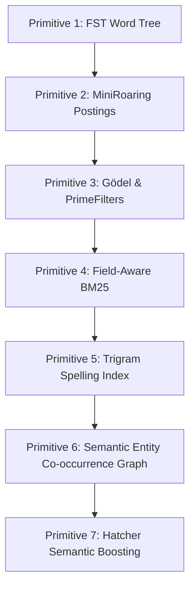

# Lume: Memory for your Documents

A high-performance Rust library and CLI suite featuring an FST-backed phrase matcher, on-demand document indexer, and field-aware BM25 hybrid search engine.

<div align="center">

[](rust_setup.md)
[](https://github.com/jsclosures)
[](https://github.com/kordless)

</div>

---

## ⚡ Quick Start Guide

Get Lume up and running in under two minutes.

### 1. Build and Test the System
Ensure you have the Rust toolchain installed (see the comprehensive [rust_setup.md](rust_setup.md) for local environment configuration), then clone and compile:
```bash
# Clone the repository
git clone https://github.com/kordless/lume.git
cd lume

# Run the test suite (MiniRoaring bitsets, FST match matrices, and spelling correctors)
cargo test

# Build fully optimized production release binaries
cargo build --release
```

### 2. Prepare a Gutenberg Test Corpus
To fetch and format *The Count of Monte Cristo* (~2.66 MB) as an on-demand test corpus:
```bash
mkdir -p examples
curl -L -s https://www.gutenberg.org/files/11/11-0.txt > examples/monte_cristo.txt

# Convert Gutenberg chapter titles into markdown headers for the parser
sed -E 's/^(CHAPTER [0-9]+)\. (.*)$/# \1. \2/' examples/monte_cristo.txt > examples/monte_cristo.md
```

### 3. Run Your First Search
Lume crawls, tokenizes, indexes, and queries the corpus in milliseconds:
```bash
# Crawl and search the entire examples/ directory on-the-fly
DATA="examples/data" cargo run --release --bin search -- examples "monte cristo"
```

### 4. Try Hatcher's Semantic Boosting REPL
Coordinate with a remote neural embedder (`shivvr.nuts.services`) to run conceptual searches:
```bash
DATA="examples/data" ALPHA=2.0 cargo run --release --bin hatcher-boost -- examples/monte_cristo.md
```

---

## 📖 The Backstory: How it All Connects

Lume is the result of a human-AI collaboration that traces its roots back through years of industry search heritage and high-speed systems engineering.

### The Search Heritage (Lucidworks & AOL)
Lume started as a fork of `fstguardrails` by [Steve Harris](https://github.com/jsclosures) (`jsclosures`), a search developer whose background includes serving as a **U.S. Marine Corps Air Traffic Controller** (Sgt MATCS-38 Det C). After his service, Steve completed his CS degree at **Washington State University** (focusing on 2D and 3D graphics rendering), interned at **Apple** in the mid-90s, and later worked as a **Sphere Lucene Developer at AOL** on natural language understanding systems. He has spent over two decades as a search consultant through his business, **Portaltown**, including extensive work with **Lucidworks**.

It was at **Lucidworks** that [Kord Campbell](https://github.com/kordless) (`kordless`) met Steve, alongside other OG search veterans like **Trey Grainger** and **Erik Hatcher**—people who had been engineering search systems for years before Kord began looking closely at the domain. (Kord also followed the work of search specialists like **Doug Turnbull**, though Doug was not at Lucidworks). Having founded **Grub** in 2000 (an open-source distributed web crawler acquired by LookSmart and Wikia/Fandom) and co-founded **Loggly** (a log search platform), Kord came from a background focused on raw systems and web-scale crawling.

### The Set Engine & The Deletion
Kord later served as Chief AI Officer for a major analytics company. It was during this time that the engineering team announced they had deleted 100,000 lines of code from their system. While Kord had no idea what those lines of code had actually done, the sheer complexity of that stack seemed unnecessary. He knew from researching and working with **Roaring Bitmaps** that pack-integer set mathematics was not actually that difficult once you understood it. He was flabbergasted by the sheer hardware speed at which roaring bitmaps could intersect massive document and segment lists. 

Kord realized that while ad networks and segment engines needed to calculate massive intersections in microseconds, their systems were really *set engines*, not true search engines. They did not fully understand the nuances of search. When Kord set out to build a document index for local memory systems, his engineering approach was quiet and intuitive: *"I don't see it, I feel it. I understand the primitive and pull from those that I see are 'right' for the job."* He decided to bring the best of both worlds together: the raw, lightweight hardware speed of set-based roaring bitmaps paired with the deep lexical and query-tagging wisdom of the search veterans.

### The 24-Hour AI Genesis
The real catalyst for Lume was a spark of observation on LinkedIn. Kord was watching Steve post about porting his zero-dependency finite-state tagger to Rust. Steve's Finite State Transducer (FST) compiled phrase dictionaries into compressed, deterministically navigable byte networks, performing longest-match phrase tagging, ASCII folding, and hyphen stripping with zero runtime dependencies. 

Kord, in desperate need of a high-performance document index for local memory systems, saw Steve's Rust port and realized: *"That is the first part of a search engine."* 

Knowing that Steve, Trey, Erik, and Doug had already defined the necessary search primitives, Kord saw that all the pieces were already there. He had recently developed a deep appreciation for Rust, particularly because he was using AI, specifically **Antigravity**, to write the code. 

Kord fired up Antigravity, which he had just containerized, and unleashed it with his foundational systems design guiding the direction. Collaborating continuously with the AI in a tight feedback loop, they brought the parts together. In less than 24 hours of continuous pair programming, Lume went from Steve's raw FST port to a fully operational, high-performance search engine mesh combining FST phrase matching, roaring bitmaps, field-aware BM25 ranking, and semantic boosting.

---

## 🛠️ The Seven Primitives of Lume

Lume is designed as a stack of modular, self-contained search primitives. Each layer builds upon the FST word tree to add query understanding, search relevance, spatial graphs, and semantic intent.



### [Primitive 1] The FST Phrase Tagger
The foundation of the engine is the Finite State Transducer. It parses dictionaries of phrases (loaded dynamically from CSV files in the `DATA` directory) and compiles them into a single FST byte map.
*   **What it does**: Scans incoming text streams and tags entities in $O(\text{text length})$ time, matching synonyms and resolving overlapping spans using a longest-match policy.
*   **OG Code Reference**:
    ```rust
    // Compiles search phrases into deterministic state paths in src/lib.rs
    let mut builder = MapBuilder::memory();
    for (key, idx) in &keyed {
        builder.insert(key, *idx)?;
    }
    ```

### [Primitive 2] MiniRoaring Bitmaps
To support lightning-fast document isolation, we represent the posting lists of the search index using roaring bitmaps.
*   **What it does**: Instead of tracking document lists with basic integer arrays or maps, Lume maps terms to custom-built `MiniRoaring` bitsets. For multi-word queries, it performs intersection (`AND`) or union (`OR`) bitsets in microseconds to immediately restrict candidate documents.
*   **OG Code Reference**:
    ```rust
    // Intersects document hit candidate sets instantly in src/fast_retrieval.rs
    pub fn intersection(&self, other: &Self) -> Self {
        // High-speed bitwise AND operations over packed integer blocks
    }
    ```

### [Primitive 3] Gödel Signatures & PrimeFilters
We use number theory to completely bypass expensive scoring loops for irrelevant documents.
*   **What it does**:
    1.  **Gödel Modulo Pruning**: If a query has FST tags, Lume skips candidate documents in $O(1)$ time by verifying if the document's perfect Gödel tag signature is divisible by the query's prime signature:
        $$\text{tagSignature} \pmod{\text{queryTagPrime}} == 0$$
    2.  **PrimeFilter Skips**: Before scoring a document, Lume checks a bitset-like signature bucket. If the division has a remainder, the document is guaranteed not to contain the term, and we skip standard HashMap lookups entirely:
        $$\text{signatures}[\text{bucket}] \pmod{\text{termPrime}} == 0$$

### [Primitive 4] Field-Aware BM25 Scoring
The lexical scoring core implements BM25 ranking, allowing fields (like document titles vs. document bodies) to carry different weights.
*   **What it does**: Evaluates matches and assigns relevance scores based on three configurable formulations: Classic, BM25+, and BM25-L (optimized for varying document lengths).
*   **OG Code Reference**:
    ```rust
    // Scoring logic configured dynamically via environment parameters:
    let bm25_score = idf * (tf * (k1 + 1.0)) / (tf + k1 * (1.0 - b + b * (doc_len / avg_len)));
    ```

### [Primitive 5] Trigram Spelling Index
A dedicated spelling corrector built directly into the indexing phase.
*   **What it does**: Breaks down both the static FST tagger phrases and the corpus terms into character-level trigrams (e.g., `"this"` $\rightarrow$ `["_th", "thi", "his", "is_"]`). It builds an inverted index of these trigrams using roaring bitmaps and BM25.
*   **Fuzzy Guardrails**: If a user misspells an FST tag (including naughty/offensive words), Lume's spelling index automatically maps it back to the closest matching dictionary term using Levenshtein edit-distance checks before querying.
*   **OG Code Reference**:
    ```rust
    // Resolves typos like "lucne" to "lucene" in src/spelling.rs
    let suggestions = spell_index.correct_word("lucne", 1); // Returns "lucene"
    ```

### [Primitive 6] Semantic Entity Co-occurrence Graph (Option A)
A mathematical graphing layer crossing FST dictionary tags with document roaring bitmaps, inspired by **Trey Grainger's** Semantic Knowledge Graph (SKG) design.
*   **What it does**: Computes the exact co-occurrence frequency and Jaccard similarity between all registered entities based on their document overlap:
    $$\text{Jaccard}(A, B) = \frac{|A \cap B|}{|A \cup B|}$$
    Drawing from Trey's original work on Solr's **Semantic Knowledge Graph (SKG)** at **Lucidworks**, this demonstrates how search indices can calculate semantic relationships dynamically. Lume serializes this network into a clean `monte_cristo_graph.json` mesh file in less than **1 millisecond** using a custom zero-dependency JSON writer, displaying a beautiful box-aligned relationship grid in the console:
    ```text
    ┌──────────────────────────────┬──────────────────────────────┬────────┬───────┐
    │ ENTITY A                     │ ENTITY B                     │JACCARD │CO-OCC │
    ├──────────────────────────────┼──────────────────────────────┼────────┼───────┤
    │ VALENTINE                    │ VILLEFORT                    │ 0.4400 │  33/75  │
    │ DANTES                       │ MARSEILLES                   │ 0.4386 │  25/57  │
    │ ALBERT                       │ MONTECRISTO                  │ 0.4368 │  38/87  │
    │ DANTES                       │ MERCEDES                     │ 0.4348 │  20/46  │
    │ DANGLARS                     │ MONTECRISTO                  │ 0.4272 │  44/103 │
    │ ALBERT                       │ PARIS                        │ 0.4186 │  36/86  │
    │ MONTECRISTO                  │ VILLEFORT                    │ 0.4144 │  46/111 │
    │ MAXIMILIAN                   │ VALENTINE                    │ 0.4043 │  19/47  │
    │ DANGLARS                     │ VILLEFORT                    │ 0.4021 │  39/97  │
    │ MARSEILLES                   │ PARIS                        │ 0.4000 │  36/90  │
    │ DANTES                       │ PHARAON                      │ 0.3750 │  15/40  │
    │ MARSEILLES                   │ VILLEFORT                    │ 0.3721 │  32/86  │
    │ FERNAND                      │ MERCEDES                     │ 0.3714 │  13/35  │
    │ DANTES                       │ FARIA                        │ 0.3684 │  14/38  │
    │ CHATEAUDIF                   │ DANTES                       │ 0.3500 │  14/40  │
    │ MARSEILLES                   │ MERCEDES                     │ 0.3455 │  19/55  │
    │ MERCEDES                     │ PHARAON                      │ 0.3429 │  12/35  │
    │ MAXIMILIAN                   │ NOIRTIER                     │ 0.3400 │  17/50  │
    └──────────────────────────────┴──────────────────────────────┴────────┴───────┘
    ```

### [Primitive 7] Erik Hatcher's Semantic Boosting & Vector Integration (`hatcher-boost`)
Our flagship hybrid integration, implementing the two-stage **Semantic Boosting** pattern pioneered by **Erik Hatcher** (co-founder of **Lucidworks**).
*   **What it does**: Combines the precision and safety of local lexical search with the conceptual awareness of deep-neural ONNX embeddings:
    1.  **Stage 1 (ONNX Semantic Retrieval)**: Establishes a connection to an ephemeral, time-seeded session on `https://shivvr.nuts.services/` to retrieve top conceptual candidates and their cosine similarity scores.
    2.  **Stage 2 (Local Lexical Scoring)**: Calculates standard BM25 rankings for candidates.
    3.  **Blending Math**: Blends both scores using Hatcher's formulation, allowing the semantic vector similarity to boost the lexical relevance score:
        $$\text{Score}_{\text{hybrid}} = \text{Score}_{\text{BM25}} \times (1.0 + \alpha \times \text{Similarity}_{\text{semantic}})$$
*   **OG Code Reference**:
    ```rust
    // Core hybrid blend in src/bin/hatcher_boost.rs
    let hybrid_score = bm25_score * (1.0 + alpha * semantic_score);
    ```

---

## 📊 Subsystem Capability Grid

| Subsystem Component | Inputs | Primary Outputs | Primary Technology |
| :--- | :--- | :--- | :--- |
| **FST Tagger** (`tag-server`) | Text Stream + CSVs | Structured JSON Spans | `tantivy-fst` Trie Walking |
| **Lexical Search** (`search`) | Multi-term Query | Ranked Text Snippets | Field-Aware BM25 + Highlighting |
| **Spelling Index** | String with Typos | Suggested Corrections | Trigram Bitmaps + Levenshtein DP |
| **Entity Mesh** (Option A) | Document Corpus | `monte_cristo_graph.json` | Pairwise Roaring Bitset Jaccard |
| **Prose Generator** (Option C) | Seed Token | Generated Text Paragraphs | Trigram Markov Chain + SimpleRng |
| **Semantic Boost** (`hatcher-boost`) | Text Stream + Query | Comparative Relevance Grid | Local BM25 + Remote Vector Embeddings |

---

## 🛠️ CLI Operations Manual

### Compile and Standard Search
```bash
# Clean build and compile fully optimized binaries
cargo build --release

# Single-file search targeting a markdown document
DATA="examples/data" cargo run --release --bin search -- examples/monte_cristo.md "mercedes dantes"

# On-demand recursive directory crawling and indexing
DATA="examples/data" cargo run --release --bin search -- examples "monte cristo"
```

### Entity Network Generation (Option A)
```bash
# Construct entity relationship mesh (computes Jaccard > 0.02)
DATA="examples/data" cargo run --release --bin search -- examples/monte_cristo.md graph 0.02
```

### Markov Prose Generation (Option C)
```bash
# Seed paragraph writer in Dumas' style
DATA="examples/data" cargo run --release --bin search -- examples/monte_cristo.md generate Dantès
```

### Erik Hatcher's Semantic Boosting
```bash
# One-shot semantic-boosting with custom alpha weight
DATA="examples/data" ALPHA=3.0 cargo run --release --bin hatcher-boost -- examples/monte_cristo.md "mercedes dantes"

# Launch the interactive semantic-boost REPL console
DATA="examples/data" ALPHA=2.0 cargo run --release --bin hatcher-boost -- examples/monte_cristo.md
```

---

## 💬 Interactive REPL Interface

Both the `search` and `hatcher-boost` binaries boot into an interactive shell when run without a query argument.

*   **Standard REPL (`search >`)**:
    *   Type any search terms (e.g. `faria dungeon`) to print ranked and highlighted snippets.
    *   `graph [min_similarity]` (e.g. `graph 0.02`) to compute the entity network.
    *   `generate [seed]` (e.g. `generate Mercédès`) to draft Dumas-styled prose.
*   **Hybrid REPL (`hybrid-search >`)**:
    *   Type queries to display side-by-side comparative columns for **Pure Lexical BM25**, **Pure Semantic (ONNX)**, and **Hatcher Boosted Hybrid** rankings.
*   **Type `exit` or `quit`** in either interface to safely terminate the session.

---

<div align="center">
<b>L U M E // BUILT IN RUST // ZERO DAMPENERS</b>
</div>
