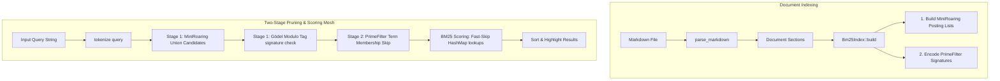

# text-tagger & Hybrid BM25-FST Search Engine

A high-performance Rust library and CLI suite featuring an FST-backed entity tagger and a field-aware BM25 search engine mesh. Built entirely on [`tantivy-fst`](https://crates.io/crates/tantivy-fst) and Rust's standard library with **zero third-party dependencies**.

## Features (Java parity & Engine additions)

| Feature | Java (`App.java`) | Rust (`text-tagger` suite) |
|---|---|---|
| FST-backed longest match (forward maximum match) | ✅ | ✅ |
| Hyphen/dash stripping (`sw-lucene` ≡ `swlucene`) | ✅ | ✅ |
| ASCII folding (`Zürich` ≡ `Zurich`) | ✅ | ✅ |
| Token separator `0x1E` between phrase tokens | ✅ | ✅ |
| Multiple records share the same FST key (synonyms emit at one span) | ✅ | ✅ |
| `Tag { start, end, surface, id, type, output }` | ✅ | ✅ |
| `output` derived as uppercase + alphanumeric, override via CSV `action` | ✅ | ✅ |
| `DATA` env loads every `*.csv` in a directory; filename → `type`; UUID v4 | ✅ | ✅ |
| HTTP server with `GET /tag`, `POST /tag`, `GET /health` | ✅ | ✅ |
| Response formats `simple` (default) and `solr` envelope | ✅ | ✅ |
| `PORT` env var | ✅ | ✅ |
| **Field-Aware BM25 Search Mesh** | ❌ | ✅ (Engine Mesh Addition) |
| **Two-Stage Candidate Pruning Pipeline (`MiniRoaring` & `PrimeFilter`)** | ❌ | ✅ (Engine Mesh Addition) |
| **Pairwise Posting List Jaccard Similarity** | ❌ | ✅ (Engine Mesh Addition) |
| **Panic-Safe Shell Piping & Unicode-Aligned Highlighting** | ❌ | ✅ (Engine Mesh Addition) |
| MCP server, REPL, full demo walkthrough | ✅ | ❌ (deliberately out of scope) |

### Known limitation: ASCII folding table

The Java version uses Lucene's `ASCIIFoldingFilter`, which covers essentially every Unicode Latin diacritic plus a long tail of folds (ligatures, fullwidth forms, math symbols, etc.). To keep the Rust port dependency-free, `fold_latin` in `src/lib.rs` ships a hand-rolled table covering the common Latin-1 / Latin Extended set (À-ÿ, ß, æ, œ, þ, …). That's enough for typical Western European text; phrases outside that range (Polish ł, Czech č, Vietnamese ơ, etc.) currently fall through to the separator path. Drop in a richer table — or wire up [`deunicode`](https://crates.io/crates/deunicode) — if you need wider coverage.

---

## Build & Test

Ensure you have Rust and Cargo installed, then build or test the workspace:

```bash
# Run unit test suite (including roaring bitmap & Gödel filter validations)
cargo test

# Build optimized production release binaries
cargo build --release
```

---

## Library Usage (FST Tagger Only)

```rust
use text_tagger::{Entry, Tagger};

let tagger = Tagger::build(vec![
    Entry::new("New York City", "CITY",    "geo:nyc"),
    Entry::new("Apache Lucene", "PRODUCT", "sw:lucene"),
    Entry::new("Zürich",        "CITY",    "geo:zur"),
])?;

for tag in tagger.tag("Ada uses Apache Lucene in Zurich") {
    println!("{}..{}  {}  id={}  output={}  surface={}",
        tag.start, tag.end, tag.kind, tag.id, tag.output, tag.surface);
}
```

---

## Hybrid BM25 & FST Search Engine Mesh

The search engine (`src/bin/search.rs` and `src/bm25.rs`) integrates standard field-aware lexical search with structural FST tag data to provide a unified, highly optimized hybrid retrieval mesh.



### 1. Two-Stage High-Performance Pruning Pipeline

To scale BM25 search queries over massive corpora at microsecond speeds, the retrieval pipeline operates in two distinct phases:

* **Stage 1 (Candidates Isolation)**:
  * **MiniRoaring Union**: A custom, zero-dependency bit-packed roaring bitmap (`MiniRoaring`) compiles the exact union of posting lists for query terms in microsecond times.
  * **Gödel Modulo Pruning**: If a query contains FST entity tags, candidate documents are immediately filtered in $O(1)$ speed using modulo arithmetic on their perfect Gödel tag signature (`tag_signature % query_tag_prime == 0`).
* **Stage 2 (Scoring & Fast Skip)**:
  * **PrimeFilter Fast Skip**: During candidate document scoring, before performing heavy key hashing and map lookups in document term-frequency maps (`title_tfs`/`body_tfs`), we query the document's partitioned `PrimeFilter` signature bucket (`signatures[bucket] % term_prime == 0`). If the test returns false, the term is guaranteed to be absent, and the scoring lookup is completely bypassed.

### 2. Supported BM25 Formulations

The scoring engine supports three popular mathematical formulations of BM25, selectable via environment variables:

1. **Classic BM25** (`classic`): The standard term-frequency length-normalized score.
2. **BM25+** (`plus`): Adds a lower-bound delta correction ($\delta$) to ensure terms occurring heavily in long documents are not over-penalized.
3. **BM25-L** (`l`): Scales term frequency directly by the document's normalization factor to handle extreme document length variation.

Parameters can be tuned via the environment:
* `VARIANT`: `classic`, `plus`, or `l` (Default: `classic`)
* `K1`: Term frequency saturation parameter (Default: `1.2`)
* `B`: Document length normalization parameter (Default: `0.75`)
* `DELTA`: Score floor addition for BM25+ (Default: `1.0`)
* `TITLE_WEIGHT`: Multiplier for title-field term matches (Default: `2.0`)
* `BODY_WEIGHT`: Multiplier for body-field term matches (Default: `1.0`)

### 3. Pairwise Posting List Jaccard Similarity

For multi-term queries, the engine automatically calculates and displays the Jaccard similarity index between the posting lists of the search terms:

$$\text{Jaccard Similarity}(A, B) = \frac{|A \cap B|}{|A \cup B|}$$

This provides instant feedback on the spatial intersection rate and correlation density of terms in your document corpus.

---

## CLI Search & REPL Console

You can run the search engine in one-shot mode by supplying query terms, or omit search terms to enter an interactive terminal REPL.

```bash
# Build & Run in production mode targeting a markdown file
DATA=examples/data cargo run --release --bin search -- examples/monte_cristo.md "edmond mercedes"
```

### Premium Terminal UX & Highlights

The search binary provides a highly polished command-line output featuring:
* **FST Entity Tag Matches**: Displays matched entities loaded from `DATA` folder inside the query itself.
* **Posting List Jaccard Similarities**: Lists pairwise overlaps and intersections for multi-term query posting lists.
* **Premium Color-Coded Snippet Highlighter**:
  * Lexical query matches are highlighted in **Bold Yellow**.
  * FST dictionary tag matches are highlighted in **Underlined Green**.
  * Dual matches (both lexical and tagged) are highlighted in **Bold Underlined Cyan**.
  * Auto-slices text to display a contextual snippet centered around the first matching term.
* **Panic-Free Shell Plumbing**: Integrates a global panic hook to gracefully handle early-closed stdout pipes (`SIGPIPE` / `BrokenPipe` / `os error 232`) when piping search output to CLI utilities like `head` or `Select-Object`.
* **Unicode Slicing Safety**: Leverages `is_char_boundary` window adjustments to guarantee panic-free string slicing around multibyte characters (like `“`, `’`, and `é`).

### Sample Output CLI Session

```text
Loaded FST dictionary: 28 records (26 keys) from DATA (kinds: intent, product, offensive_en)
Indexed 235 Markdown sections in 197.18ms
Searching for: "edmond mercedes" (Variant: Classic)
  └─ Query Term Posting List Jaccard Similarities:
     - 'edmond' vs 'mercedes': 0.4222 (Intersection: 19, Union: 45)
[Two-Stage Pruning] Pruned candidate space from 235 to 45 (roaring generated: 45) sections in 15.10us
Found 45 ranked results in 58.40us

Rank 1 | Score: 8.7421
Header: Chapter 1. Marseilles—The Arrival (Line 1)
... Dantes had arrived, and edmond was safe in Marseilles, though his thoughts remained with mercedes ...
```

---

## Loading CSVs (`DATA` directory)

Each CSV's filename (without `.csv`) becomes the `type` for every record from that file. The first row is the header. If a column named `action` is present, its value becomes the record's `output` token (otherwise `output` is derived from the phrase = uppercase + alphanumeric).

Sample data shipped in `examples/data/` is copied verbatim from the upstream Java repo (`intent.csv`, `product.csv`, `offensive_en.csv`).

```
intent,action,response
view,VIEW,Viewing
track my order,STATUS,Tracking your order
buy,BUY,Buying
```

A row's `id` is a fresh UUID v4 (matches Java behaviour).

---

## How FST Matching Works

1. Input is folded (hyphen-strip → ASCII fold → lowercase) into ASCII tokens with original byte offsets preserved.
2. From each token cursor `i`, the matcher walks the FST byte by byte; the inter-token separator `0x1E` is fed between tokens.
3. Every visit to a final state records a match. The longest match wins (Java's forward-maximum-match), and overlapping shorter matches are skipped. When multiple records share the matched FST key (synonyms), the tagger emits one `Tag` per record at the same span.
