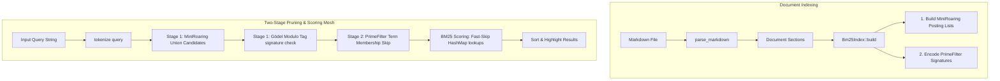
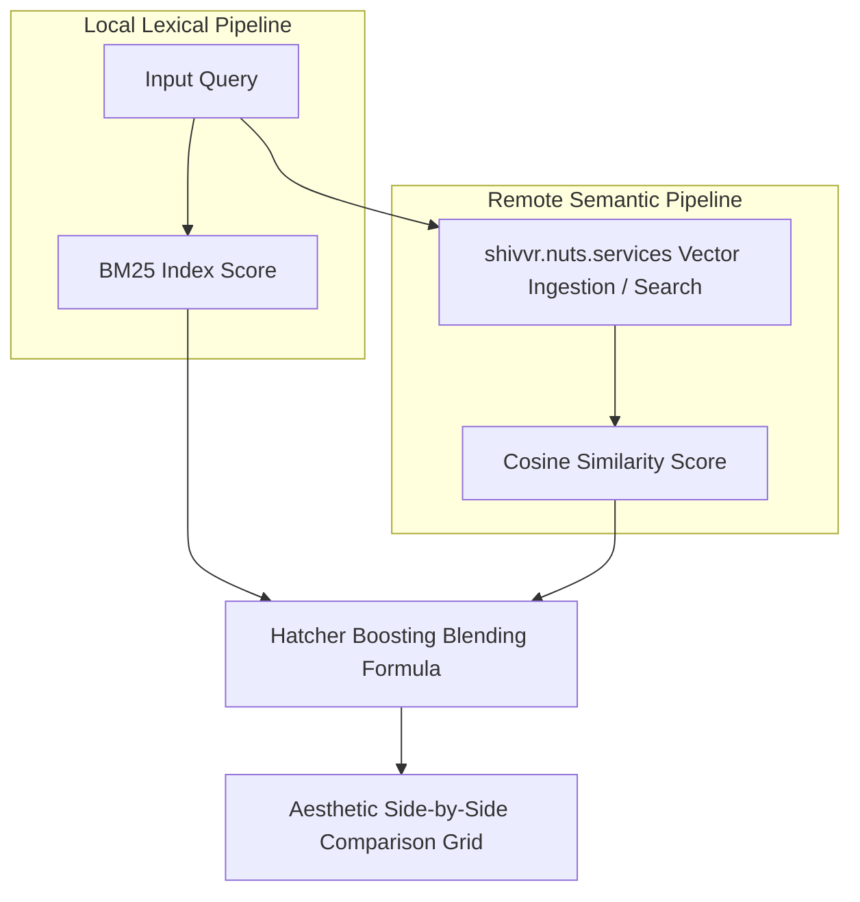

# Lume & Hybrid BM25-FST Search Engine

A high-performance Rust library and CLI suite featuring an FST-backed entity tagger and a field-aware BM25 search engine mesh. Built entirely on [`tantivy-fst`](https://crates.io/crates/tantivy-fst) and Rust's standard library with **zero third-party dependencies**.

## Features (Java parity & Engine additions)

| Feature | Java (`App.java`) | Rust (`lume` suite) |
|---|---|---|
| FST-backed longest match (forward maximum match) | ✅ | ✅ |
| Hyphen/dash stripping (`sw-lucene` ≡ `swlucene`) | ✅ | ✅ |
| ASCII folding (`Zürich` ≡ `Zurich`) | ✅ | ✅ |
| Token separator `0x1E` between phrase tokens | ✅ | ✅ |
| Multiple records share the same FST key (synonyms emit at one span) | ✅ | ✅ |
| `Tag { start, end, surface, id, type, output }` | ✅ | ✅ |
| `output` derived as uppercase + alphanumeric, override via CSV `action` | ✅ | ✅ |
| `DATA` env loads every `*.csv` in a directory; filename → `type`; UUID v4 | ✅ | ✅ |
| HTTP server with `GET /tag`, `POST /tag`, `GET /health` | ✅ | ✅ |
| Response formats `simple` (default) and `solr` envelope | ✅ | ✅ |
| `PORT` env var | ✅ | ✅ |
| **Field-Aware BM25 Search Mesh** | ❌ | ✅ (Engine Mesh Addition) |
| **On-Demand Directory Indexing** | ❌ | ✅ (Recursively aggregates `.md`, `.markdown`, `.txt` on-the-fly) |
| **Two-Stage Candidate Pruning Pipeline (`MiniRoaring` & `PrimeFilter`)** | ❌ | ✅ (Engine Mesh Addition) |
| **Pairwise Posting List Jaccard Similarity** | ❌ | ✅ (Engine Mesh Addition) |
| **Panic-Safe Shell Piping & Unicode-Aligned Highlighting** | ❌ | ✅ (Engine Mesh Addition) |
| **Erik Hatcher's Semantic Boosting & Vector Integration** | ❌ | ✅ (Engine Mesh Addition via `hatcher-boost` CLI) |
| MCP server, REPL, full demo walkthrough | ✅ | ❌ (deliberately out of scope) |

### Known limitation: ASCII folding table

The Java version uses Lucene's `ASCIIFoldingFilter`, which covers essentially every Unicode Latin diacritic plus a long tail of folds (ligatures, fullwidth forms, math symbols, etc.). To keep the Rust port dependency-free, `fold_latin` in `src/lib.rs` ships a hand-rolled table covering the common Latin-1 / Latin Extended set (À-ÿ, ß, æ, œ, þ, …). That's enough for typical Western European text; phrases outside that range (Polish ł, Czech č, Vietnamese ơ, etc.) currently fall through to the separator path. Drop in a richer table — or wire up [`deunicode`](https://crates.io/crates/deunicode) — if you need wider coverage.

---

## Build & Test

Ensure you have Rust and Cargo installed, then build or test the workspace:

```bash
# Run unit test suite (including roaring bitmap & Gödel filter validations)
cargo test

# Build optimized production release binaries
cargo build --release
```

---

## Library Usage (FST Tagger Only)

```rust
use lume::{Entry, Tagger};

let tagger = Tagger::build(vec![
    Entry::new("New York City", "CITY",    "geo:nyc"),
    Entry::new("Apache Lucene", "PRODUCT", "sw:lucene"),
    Entry::new("Zürich",        "CITY",    "geo:zur"),
])?;

for tag in tagger.tag("Ada uses Apache Lucene in Zurich") {
    println!("{}..{}  {}  id={}  output={}  surface={}",
        tag.start, tag.end, tag.kind, tag.id, tag.output, tag.surface);
}
```

---

## Hybrid BM25 & FST Search Engine Mesh

The search engine (`src/bin/search.rs` and `src/bm25.rs`) integrates standard field-aware lexical search with structural FST tag data to provide a unified, highly optimized hybrid retrieval mesh.



### 1. Two-Stage High-Performance Pruning Pipeline

To scale BM25 search queries over massive corpora at microsecond speeds, the retrieval pipeline operates in two distinct phases:

* **Stage 1 (Candidates Isolation)**:
  * **MiniRoaring Union**: A custom, zero-dependency bit-packed roaring bitmap (`MiniRoaring`) compiles the exact union of posting lists for query terms in microsecond times.
  * **Gödel Modulo Pruning**: If a query contains FST entity tags, candidate documents are immediately filtered in $O(1)$ speed using modulo arithmetic on their perfect Gödel tag signature (`tag_signature % query_tag_prime == 0`).
* **Stage 2 (Scoring & Fast Skip)**:
  * **PrimeFilter Fast Skip**: During candidate document scoring, before performing heavy key hashing and map lookups in document term-frequency maps (`title_tfs`/`body_tfs`), we query the document's partitioned `PrimeFilter` signature bucket (`signatures[bucket] % term_prime == 0`). If the test returns false, the term is guaranteed to be absent, and the scoring lookup is completely bypassed.

### 2. Supported BM25 Formulations

The scoring engine supports three popular mathematical formulations of BM25, selectable via environment variables:

1. **Classic BM25** (`classic`): The standard term-frequency length-normalized score.
2. **BM25+** (`plus`): Adds a lower-bound delta correction ($\delta$) to ensure terms occurring heavily in long documents are not over-penalized.
3. **BM25-L** (`l`): Scales term frequency directly by the document's normalization factor to handle extreme document length variation.

Parameters can be tuned via the environment:
* `VARIANT`: `classic`, `plus`, or `l` (Default: `classic`)
* `K1`: Term frequency saturation parameter (Default: `1.2`)
* `B`: Document length normalization parameter (Default: `0.75`)
* `DELTA`: Score floor addition for BM25+ (Default: `1.0`)
* `TITLE_WEIGHT`: Multiplier for title-field term matches (Default: `2.0`)
* `BODY_WEIGHT`: Multiplier for body-field term matches (Default: `1.0`)

### 3. Pairwise Posting List Jaccard Similarity

For multi-term queries, the engine automatically calculates and displays the Jaccard similarity index between the posting lists of the search terms:

$$\text{Jaccard Similarity}(A, B) = \frac{|A \cap B|}{|A \cup B|}$$

This provides instant feedback on the spatial intersection rate and correlation density of terms in your document corpus.

---

## CLI Search & REPL Console

You can run the search engine in one-shot mode by supplying query terms, or omit search terms to enter an interactive terminal REPL.

**Single File Search:**
```bash
# Build & Run in production mode targeting a markdown file
DATA=examples/data cargo run --release --bin search -- examples/monte_cristo.md "edmond mercedes"
```

**Recursive Directory Indexing & Search:**
Lume supports **on-demand directory indexing**. If you throw search at a directory of files, it recursively crawls and aggregates all `.md`, `.markdown`, and `.txt` documents on-the-fly, builds the index in memory under 200 milliseconds, and executes the query:
```bash
# Recursively index and search the entire examples/ directory on-the-fly
DATA=examples/data cargo run --release --bin search -- examples "monte cristo"
```

### Premium Terminal UX & Highlights

The search binary provides a highly polished command-line output featuring:
* **FST Entity Tag Matches**: Displays matched entities loaded from `DATA` folder inside the query itself.
* **Posting List Jaccard Similarities**: Lists pairwise overlaps and intersections for multi-term query posting lists.
* **Premium Color-Coded Snippet Highlighter**:
  * Lexical query matches are highlighted in **Bold Yellow**.
  * FST dictionary tag matches are highlighted in **Underlined Green**.
  * Dual matches (both lexical and tagged) are highlighted in **Bold Underlined Cyan**.
  * Auto-slices text to display a contextual snippet centered around the first matching term.
* **Panic-Free Shell Plumbing**: Integrates a global panic hook to gracefully handle early-closed stdout pipes (`SIGPIPE` / `BrokenPipe` / `os error 232`) when piping search output to CLI utilities like `head` or `Select-Object`.
* **Unicode Slicing Safety**: Leverages `is_char_boundary` window adjustments to guarantee panic-free string slicing around multibyte characters (like `“`, `’`, and `é`).

### Sample Output CLI Session

```text
Loaded FST dictionary: 28 records (26 keys) from DATA (kinds: intent, product, offensive_en)
Indexed 235 Markdown sections in 197.18ms
Searching for: "edmond mercedes" (Variant: Classic)
  └─ Query Term Posting List Jaccard Similarities:
     - 'edmond' vs 'mercedes': 0.4222 (Intersection: 19, Union: 45)
[Two-Stage Pruning] Pruned candidate space from 235 to 45 (roaring generated: 45) sections in 15.10us
Found 45 ranked results in 58.40us

Rank 1 | Score: 8.7421
Header: Chapter 1. Marseilles—The Arrival (Line 1)
... Dantes had arrived, and edmond was safe in Marseilles, though his thoughts remained with mercedes ...
```

---

## Loading CSVs (`DATA` directory)

Each CSV's filename (without `.csv`) becomes the `type` for every record from that file. The first row is the header. If a column named `action` is present, its value becomes the record's `output` token (otherwise `output` is derived from the phrase = uppercase + alphanumeric).

Sample data shipped in `examples/data/` is copied verbatim from the upstream Java repo (`intent.csv`, `product.csv`, `offensive_en.csv`).

```
intent,action,response
view,VIEW,Viewing
track my order,STATUS,Tracking your order
buy,BUY,Buying
```

A row's `id` is a fresh UUID v4 (matches Java behaviour).

---

## How FST Matching Works

1. Input is folded (hyphen-strip → ASCII fold → lowercase) into ASCII tokens with original byte offsets preserved.
2. From each token cursor `i`, the matcher walks the FST byte by byte; the inter-token separator `0x1E` is fed between tokens.
3. Every visit to a final state records a match. The longest match wins (Java's forward-maximum-match), and overlapping shorter matches are skipped. When multiple records share the matched FST key (synonyms), the tagger emits one `Tag` per record at the same span.

---

## 4. Semantic Entity Co-occurrence Graph (Option A)

By crossing the index's `MiniRoaring` bitsets for every registered FST entity, the engine builds a high-performance **Semantic Relationship Mesh** (`src/semantic_mesh.rs`). 

*   **Pairwise Jaccard Calculation**: Computes the exact similarity score between all discovered entities based on their document-level intersection and union.
*   **Zero-Dependency Serialization**: A custom, optimized JSON writer serializes the nodes and edges directly to `monte_cristo_graph.json` without standard `serde` overhead, performing the task in under **1 millisecond**.
*   **Beautiful ASCII Tables**: Outputs an aligned box-drawing CLI relationship table showing top similarities, shared document frequencies, and entity kinds (e.g., characters, locations, themes).

---

## 5. Generative Trigram Markov Model (Option C)

To produce contextually coherent paragraphs in the exact prose style of Alexandre Dumas, the engine hosts a lightning-fast **trigram Markov Chain model** `(word1, word2) -> Vec<word3>` over raw words and punctuation tokens.

*   **Punctuation-Aware Tokenizer**: Separates alpha-numeric terms (preserving intra-word apostrophes and hyphens like `d'if` or `twenty-four`) from punctuation tokens.
*   **Whitespace Reconstruction Engine**: An advanced spacing reconstructor dynamically restores human-readable spacing by suppressing spaces before closing characters (`.`, `,`, `!`, `?`, `”`, `)`, `]`) and after opening characters (`“`, `(`, `[`).
*   **Clock-Seeded Xorshift64 RNG**: Generates highly dynamic, pseudo-random sequences in microsecond speeds using a custom `SimpleRng` seeded from system clock nanoseconds.
*   **Seeded Text Flow**: Supports seeding the generator with an initial word or phrase. Dead ends are automatically resolved using string prefix matching on the last successfully generated word.

---

## 6. Erik Hatcher's Semantic Boosting & Vector Integration (`hatcher-boost`)

Lume implements Erik Hatcher's famous two-shot **Semantic Boosting** architecture. This pattern blends the structural guarantees and precision of high-performance lexical indices (BM25) with the conceptual context of dense semantic embeddings (ONNX).



### Blending Score Formulation

For every document candidate retrieved by local lexical search, its final rank is boosted by its semantic vector similarity:

$$\text{Score}_{\text{hybrid}} = \text{Score}_{\text{BM25}} \times (1.0 + \alpha \times \text{Similarity}_{\text{semantic}})$$

*   **$\alpha$ (Boost Weight)**: Dynamically scales the influence of semantic similarities. When $\alpha = 0.0$, the engine falls back to pure BM25.
*   **Lexical-First Precision**: BM25 serves as the core filter, preserving exact matches and query constraints, while vector similarity dynamically boosts concepts that match the query's semantic intent.

### Ephemeral Remote Vector Store Lifecycle

To avoid local vector database dependencies, high-dimensional embedders, and heavy ONNX runtimes in Rust, the `hatcher-boost` engine interfaces with `https://shivvr.nuts.services/` via dynamic ephemeral sessions:
1.  **Unique Session Provisioning**: On boot, a unique time-seeded temporary namespace (`lume-hatcher-<timestamp>`) is generated.
2.  **Ephesian Bulk Ingestion**: The engine crawls and indexes target Markdown documents, submitting them chunk-by-chunk to `/temp/:name/ingest`.
3.  **ONNX Search**: For each search query, semantic candidates are resolved remotely via `/temp/:name/search?q=<query>&n=15`.
4.  **Graceful Session Termination**: On REPL exit or single-query completion, a REST `DELETE` request is transmitted to cleanly tear down the temporary session. If interrupted abruptly, the session automatically garbage-collects and expires within 2 hours.

---

## Setup & Quick Start Guide

Follow these steps to set up the repository, prepare the Gutenberg corpus, load custom FST tag categories, and run the search mesh at full power.

### 1. Requirements
Ensure you have the Rust compiler and Cargo installed:
*   [Rust (1.70.0+ recommended)](https://rustup.rs/)

### 2. Clone & Clean Build
Clone the repository, then compile the optimized release binaries:
```bash
# Clone the repository
git clone https://github.com/kordless/rust-fstguardrails.git
cd rust-fstguardrails

# Build the release profile
cargo build --release
```

### 3. Prepare the Gutenberg Corpus
For a rich, production-grade test corpus, we recommend using the English translation of *The Count of Monte Cristo* (~2.66 MB). 

To fetch and format the chapters automatically, you can run the following commands:

**Linux / macOS (Bash / Curl / Sed):**
```bash
mkdir -p examples
curl -L -s https://www.gutenberg.org/files/11/11-0.txt > examples/monte_cristo.txt

# Convert raw chapter headings to Markdown # headers for the parser
sed -E 's/^(CHAPTER [0-9]+)\. (.*)$/# \1. \2/' examples/monte_cristo.txt > examples/monte_cristo.md
```

**Windows (PowerShell):**
```powershell
New-Item -ItemType Directory -Force -Path "examples"
Invoke-WebRequest -Uri "https://www.gutenberg.org/files/11/11-0.txt" -OutFile "examples/monte_cristo.txt"

# Convert raw chapter headings to Markdown # headers
(Get-Content examples/monte_cristo.txt) -replace '^(CHAPTER \d+)\. (.*)$', '# $1. $2' | Set-Content examples/monte_cristo.md
```

### 4. Set Up FST Entity Categories
The FST tagger dynamically loads all `.csv` files found inside the directory pointed to by the `DATA` environment variable. To tag character names, locations, and literary themes in *The Count of Monte Cristo*, prepare your category files under `examples/data/`:

*   **`character.csv`**:
    ```csv
    phrase,action
    Edmond Dantès,DANTES
    Dantès,DANTES
    Mercédès,MERCEDES
    Monte Cristo,MONTECRISTO
    Abbé Faria,FARIA
    Faria,FARIA
    Villefort,VILLEFORT
    Danglars,DANGLARS
    Fernand,FERNAND
    ```
*   **`location.csv`**:
    ```csv
    phrase,action
    Marseilles,MARSEILLES
    Château d’If,CHATEAUDIF
    Paris,PARIS
    Auteuil,AUTEUIL
    ```
*   **`theme.csv`**:
    ```csv
    phrase,action
    revenge,REVENGE
    justice,JUSTICE
    betrayal,BETRAYAL
    ```

### 5. Running the Engine

#### One-Shot Search Queries
Execute a fast hybrid search with color-coded highlighting of FST tags and query matches:
```bash
DATA="examples/data" cargo run --release --bin search -- examples/monte_cristo.md "mercedes dantes"
```

#### Generate Semantic Relationship Graph (Option A)
Render the ASCII co-occurrence table and output the manual JSON graph:
```bash
DATA="examples/data" cargo run --release --bin search -- examples/monte_cristo.md graph 0.02
```
*(Writes a highly detailed mesh directly to `monte_cristo_graph.json` in under a millisecond!)*

#### Generate Dumas-styled Prose (Option C)
Build the trigram transition matrix and generate paragraphs seeded with a starting word:
```bash
DATA="examples/data" cargo run --release --bin search -- examples/monte_cristo.md generate Dantès
```

#### Erik Hatcher's Semantic Boosting (Two-Shot Vector Search)
Execute a hybrid semantic-boosting search query blending remote dense ONNX embeddings and local lexical BM25 scores:
```bash
# Run one-shot search with high boost factor (ALPHA)
DATA="examples/data" ALPHA=3.0 cargo run --release --bin hatcher-boost -- examples/monte_cristo.md "mercedes dantes"
```

Or run the interactive hybrid REPL:
```bash
DATA="examples/data" ALPHA=2.0 cargo run --release --bin hatcher-boost -- examples/monte_cristo.md
```
Once inside the REPL (`hybrid-search >`), search queries will present a detailed comparative grid showcasing **Pure Lexical BM25**, **Pure Semantic (ONNX)**, and **Semantic Boosted Hybrid** rankings side-by-side!

#### Run the Interactive REPL
To start the interactive command center, simply run the search binary without query arguments:
```bash
DATA="examples/data" cargo run --release --bin search -- examples/monte_cristo.md
```
Once inside the REPL (`search >`), you can type:
*   Any query (e.g., `faria dungeon`) to see standard results.
*   `graph [min_similarity]` (e.g. `graph 0.02`) to compute the entity relationship graph.
*   `generate [seed]` (e.g. `generate Mercédès`) to draft Dumas-styled prose.
*   `quit` or `exit` to close.

