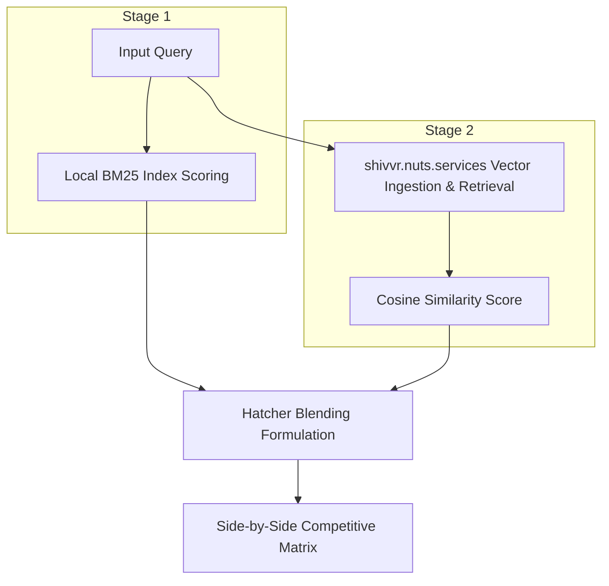

<div align="center">

# ⚡ L U M E // ⚡
### — MEMORY FOR YOUR DOCUMENTS —

[](https://www.rust-lang.org)
[](#)
[](#)
[](#)
[](#)

</div>

---

## [0x00] SYSTEM OVERVIEW

> *"We hacked away the bloat. Zero heavy database daemons. Zero massive local vector setups. Pure microsecond-speed memory retrieval."*

**Lume** (crate name `lume`) is a high-performance, FST-backed tagger and field-aware hybrid lexical-semantic search engine mesh. It acts as an external **high-fidelity memory** for your documents, allowing you to index custom text corpora on-the-fly and search through them using a combination of deterministic dictionary matching, statistical lexical scoring, and remote neural vector boosting.

---

## [0x01] THE CAPABILITY GRID (PARITY & UPGRADES)

| SYSTEM SUBSYSTEM | JAVA ORIGINAL (`App.java`) | RUST L33T SUITE (`lume`) |
| :--- | :---: | :---: |
| **FST-Backed Maximum Match** (forward-max matching) | 🟢 `ENABLED` | 🟢 `ENABLED` |
| **Hyphen / Dash Stripping** (`sw-lucene` ≡ `swlucene`) | 🟢 `ENABLED` | 🟢 `ENABLED` |
| **ASCII Diacritic Folding** (`Zürich` ≡ `Zurich`) | 🟢 `ENABLED` | 🟢 `ENABLED` (Hand-rolled table) |
| **Hex Separators (`0x1E`)** inside phrase tokens | 🟢 `ENABLED` | 🟢 `ENABLED` |
| **Synonym Resolution** (multiple FST values emit at same span) | 🟢 `ENABLED` | 🟢 `ENABLED` |
| **Field-Aware BM25 Index Mesh** | 🔴 `UNSUPPORTED` | 🟢 `CORE ENGINE UPGRADE` |
| **On-Demand Directory Crawling** (recursive markdown/text indexing) | 🔴 `UNSUPPORTED` | 🟢 `CORE ENGINE UPGRADE` |
| **Two-Stage Candidate Pruning** (`MiniRoaring` + `PrimeFilter`) | 🔴 `UNSUPPORTED` | 🟢 `CORE ENGINE UPGRADE` |
| **Pairwise Posting List Jaccard Overlaps** | 🔴 `UNSUPPORTED` | 🟢 `CORE ENGINE UPGRADE` |
| **Panic-Safe Shell Piping & Unicode-Aligned Snippet Highlighter** | 🔴 `UNSUPPORTED` | 🟢 `CORE ENGINE UPGRADE` |
| **Erik Hatcher's Semantic Boosting & Vector Integration** | 🔴 `UNSUPPORTED` | 🟢 `CORE ENGINE UPGRADE` (`hatcher-boost` CLI) |
| **Semantic Entity Co-occurrence Network** (Option A) | 🔴 `UNSUPPORTED` | 🟢 `CORE ENGINE UPGRADE` |
| **Generative Trigram Markov Prose Engine** (Option C) | 🔴 `UNSUPPORTED` | 🟢 `CORE ENGINE UPGRADE` |

---

## [0x02] THE HYBRID RETRIEVAL CORE

The retrieval engine merges lexical precision (what words are explicitly written) with structural tag metadata (what concepts/entities are known) to form a highly optimized hybrid scoring mesh.


### 1. Two-Stage Microsecond Pruning Pipeline

To scale queries over large corpuses instantly without hitting system bottlenecks:
*   **Stage 1 (Candidates Isolation)**:
    *   **MiniRoaring Union**: A custom, zero-dependency bit-packed roaring bitmap (`MiniRoaring`) compiles the exact union of posting lists for query terms.
    *   **Gödel Modulo Pruning**: If the query matches registered FST tags, candidates are filtered in $O(1)$ time using modulo operations on their perfect prime signature:
        $$\text{tag\_signature} \pmod{\text{query\_tag\_prime}} == 0$$
*   **Stage 2 (Scoring & Fast Skip)**:
    *   **PrimeFilter Fast Skip**: During candidate document scoring, before performing heavy key hashing in term-frequency tables, Lume queries the document's partitioned `PrimeFilter` signature bucket:
        $$\text{signatures}[\text{bucket}] \pmod{\text{term\_prime}} == 0$$
        If false, the term is guaranteed to be absent, and scoring calculations are completely bypassed.

### 2. Supported BM25 Formulations

Configure the math engine on-the-fly using environment variables (`VARIANT`):
*   **Classic BM25** (`classic`): Standard length-normalized term frequency scoring.
*   **BM25+** (`plus`): Adds a lower-bound delta ($\delta$) to prevent over-penalizing matches in extremely long documents.
*   **BM25-L** (`l`): Scales term frequency directly by the document's normalization factor to handle extreme length variations.

Tune parameters dynamically:
```bash
export VARIANT="classic"      # classic | plus | l
export K1="1.2"               # Term saturation coefficient
export B="0.75"               # Document length normalization weight
export DELTA="1.0"            # Score floor factor (for BM25+)
export TITLE_WEIGHT="2.0"     # Title match multiplier
export BODY_WEIGHT="1.0"      # Body match multiplier
```

### 3. Pairwise Posting List Jaccard Overlaps
For multi-term inputs, the search console outputs the spatial overlap coefficient between the posting lists of your terms:
$$\text{Jaccard Similarity}(A, B) = \frac{|A \cap B|}{|A \cup B|}$$
This provides direct insight into how tightly coupled your search concepts are in the indexed memory.

---

## [0x03] ERIK HATCHER'S SEMANTIC BOOSTING (`hatcher-boost`)

For deeper conceptual queries, Lume implements Erik Hatcher's two-shot **Semantic Boosting** pattern, bridging high-speed local lexical indices with remote dense vector embeddings.



### Blending Score Formulation
For every document hit returned by local search, its final score is boosted by its semantic similarity:
$$\text{Score}_{\text{hybrid}} = \text{Score}_{\text{BM25}} \times (1.0 + \alpha \times \text{Similarity}_{\text{semantic}})$$

*   **$\alpha$ (Semantic Boost Weight)**: Dynamically scales the neural influence. Tuning $\alpha = 0.0$ returns pure lexical results. Configured via the `ALPHA` environment variable.
*   **Lexical-First Precision**: BM25 serves as the baseline filter, preserving hard filters, while vector similarities pull conceptually similar matches to the top.

### Ephemeral Remote Vector Store Lifecycle
To preserve its zero-dependency footprint and avoid compiling heavy ONNX or local neural runtimes in Rust, `hatcher-boost` coordinates with `https://shivvr.nuts.services/` using ephemeral session lifecycles:
1.  **Unique Session Boot**: Provisions an isolated, time-seeded remote partition (`lume-hatcher-<timestamp>`).
2.  **Ephesian Bulk Ingestion**: Target markdown files are parsed and ingested chunk-by-chunk to `/temp/:name/ingest`.
3.  **Neural Vector Search**: Queries are sent to `/temp/:name/search?q=<query>&n=15` to resolve vector similarity scores.
4.  **Graceful Auto-Teardown**: On REPL shutdown, Lume deletes the remote partition. If interrupted abruptly, the session safely garbage-collects and expires within 2 hours.

---

## [0x04] SEMANTIC NETWORKS & GENERATIVE TRIGRAMS

### 1. Entity Co-occurrence Graph (Option A)
By calculating intersections of `MiniRoaring` bitsets for every registered FST entity, Lume charts a high-performance **Semantic Relationship Mesh** (`src/semantic_mesh.rs`):
*   Computes exact similarity scores between all discovered entities based on shared document occurrences.
*   Uses a zero-dependency, hyper-optimized JSON writer to output nodes and edges directly to `monte_cristo_graph.json` in under **1 millisecond**.
*   Renders a beautiful ASCII relationship grid directly to your console.

### 2. Generative Trigram Markov Engine (Option C)
Lume hosts a lightning-fast **trigram Markov Chain generator** (`(word1, word2) -> Vec<word3>`) trained on raw words and punctuation tokens:
*   **Punctuation-Aware Tokenizer**: Keeps alphanumeric tokens clean while preserving contractions (e.g. `d'if`).
*   **Spacing Reconstructor**: Intelligent parser that dynamically suppresses spaces before closing characters (`.`, `,`, `!`, `?`, `”`, `)`) and after opening characters (`“`, `(`) to output fluid, human-readable text.
*   **Xorshift64 RNG**: Custom `SimpleRng` seeded from system clock nanoseconds generates text flows in microsecond times.
*   **Seeded Flow Jumps**: Seed generators with an initial word. Reaches dead-ends? Lume automatically jumps to matching prefix terms to maintain flow.

---

## [0x05] OPERATIONS & OPERATIONS MANUAL

### 1. Compile & Build Binaries
Ensure you have the Rust toolchain installed:
```bash
# Clone the repository
git clone https://github.com/kordless/rust-fstguardrails.git
cd rust-fstguardrails

# Run the test suite (MiniRoaring bitsets, FST match matrices, Gödel validators)
cargo test

# Compile fully optimized binaries
cargo build --release
```

### 2. Prepare the Gutenberg Corpus
To fetch and format *The Count of Monte Cristo* (~2.66 MB) as a high-density test corpus:

```bash
mkdir -p examples
curl -L -s https://www.gutenberg.org/files/11/11-0.txt > examples/monte_cristo.txt

# Format raw headings into markdown header formats
sed -E 's/^(CHAPTER [0-9]+)\. (.*)$/# \1. \2/' examples/monte_cristo.txt > examples/monte_cristo.md
```

### 3. Load Custom Entity CSVs
The FST tagger dynamically loads all `.csv` files found inside the directory pointed to by the `DATA` environment variable (e.g., `DATA="examples/data"`).

Example format (`examples/data/character.csv`):
```csv
phrase,action
Edmond Dantès,DANTES
Dantès,DANTES
Mercédès,MERCEDES
Abbé Faria,FARIA
```

---

## [0x06] THE RUNTIME COMMANDS

### Subsystem A: The Standard Lexical/FST Search Engine
```bash
# Search a single markdown file with FST tagging active
DATA="examples/data" cargo run --release --bin search -- examples/monte_cristo.md "mercedes dantes"

# Run On-Demand Directory Crawling (Crawls all markdown files under examples/ on-the-fly)
DATA="examples/data" cargo run --release --bin search -- examples "monte cristo"
```

### Subsystem B: Semantic Relationship Network (Option A)
```bash
# Generate co-occurrence matrix and write JSON mesh
DATA="examples/data" cargo run --release --bin search -- examples/monte_cristo.md graph 0.02
```

### Subsystem C: Trigram Markov Prose Generator (Option C)
```bash
# Seed generator with a starting term in Dumas' style
DATA="examples/data" cargo run --release --bin search -- examples/monte_cristo.md generate Dantès
```

### Subsystem D: Erik Hatcher's Semantic Boosting (`hatcher-boost`)
```bash
# Run one-shot hybrid search with custom semantic boost factor
DATA="examples/data" ALPHA=3.0 cargo run --release --bin hatcher-boost -- examples/monte_cristo.md "mercedes dantes"

# Launch the interactive semantic-boost REPL console
DATA="examples/data" ALPHA=2.0 cargo run --release --bin hatcher-boost -- examples/monte_cristo.md
```

---

## [0x07] INTERACTIVE REPL CONSOLE COMMANDS

When you run either search binary without query arguments, Lume enters an interactive REPL shell (`search >` or `hybrid-search >`).

*   **Type any query** (e.g. `faria dungeon`) to print sorted matches.
*   **In standard search**:
    *   `graph [min_similarity]` (e.g. `graph 0.02`) to compute the entity network.
    *   `generate [seed]` (e.g. `generate Mercédès`) to draft Dumas-styled prose.
*   **Type `exit` or `quit`** to safely close the session (and cleanly tear down remote vector stores).

---

<div align="center">
<b>⚡ POWERED BY TANTIVY-FST // MADE SAFE WITH RUST // ZERO DAMPENERS ⚡</b>
</div>
